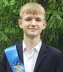

# Портфолио
## Лазарюк Максим Викторович (16 лет)
 

### Факты обо мне
- Учусь на [Нетологии](https://netology.ru/) на курсе [Fullstack-разработчик на Python](https://netology.ru/programs/fullstack-python-dev?recommended_by=instant_search#/)
- Люблю кино, сериалы, комиксы и программирование
  
### Идеи проектов
1. Среда программирования с встроенным голосовым помощником
2. Онлайн город (многопользовательская игра)